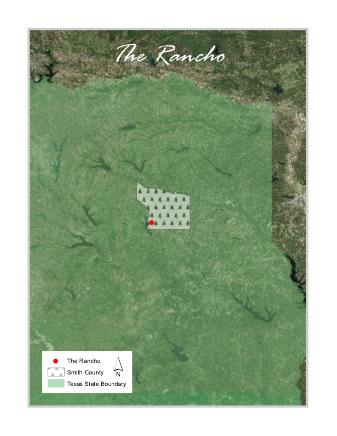

## GIS Portfolio

### Hello ESRI
#### *Mapping home in East Texas*

### Presidential Voting in Texas by State House District: 2012 vs 2016
#### *Mapping change over time*

### Superfund Sites on East Texas Water Bodies
#### *Clipping and querying data*

### Infant Mortality Rates, Race, and Superfund Sites in Houston
#### *Mapping environmental injustice*

### Prevalence of Renting in Limestone County
#### *Mapping census data* 

### Wayfinding at Southwestern
#### *Collecting GPS data and creating shapefiles*

### Hidden Data in the Census
#### *Mapping with multiple census units*

### Austin Fire Department Parade Route
#### *Problem-solving with network analysis*

I made the map below using QGIS then incorporated it into a flyer for a hypothetical parade.

